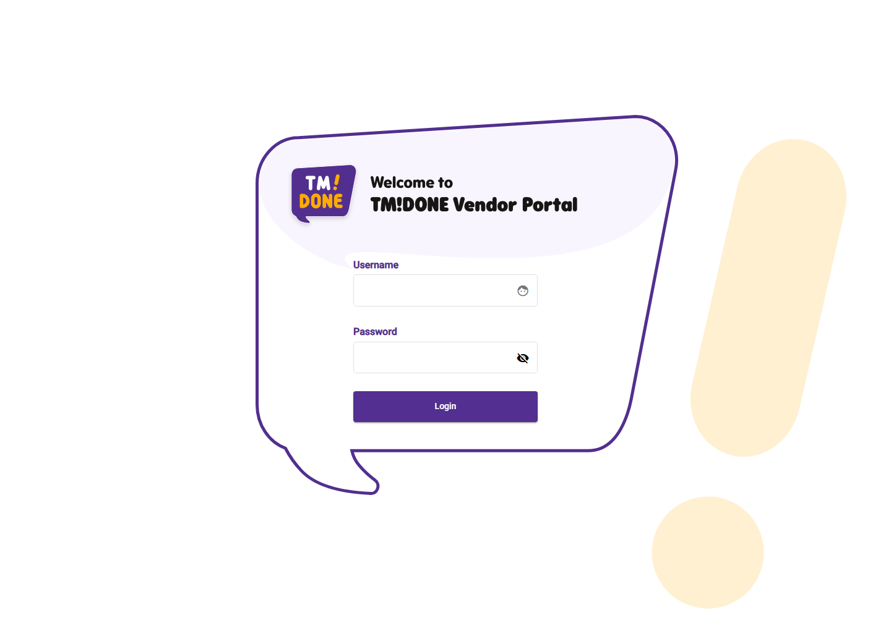
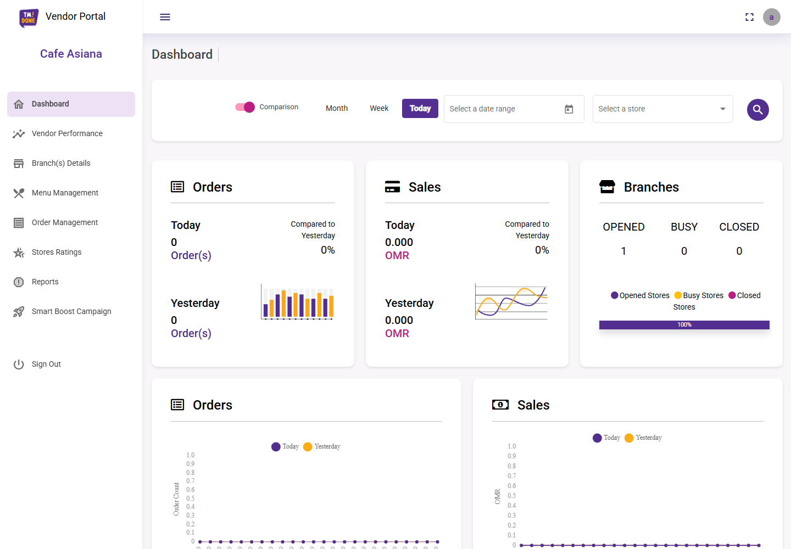
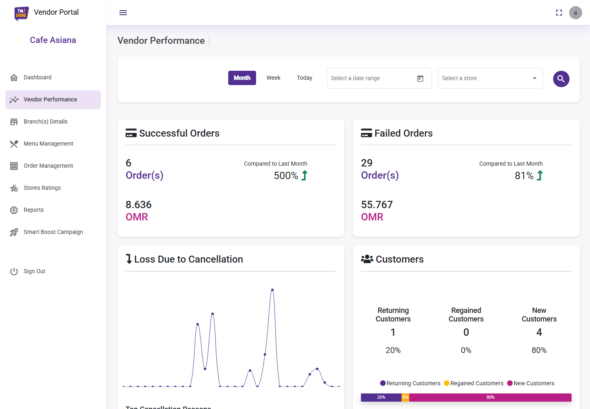
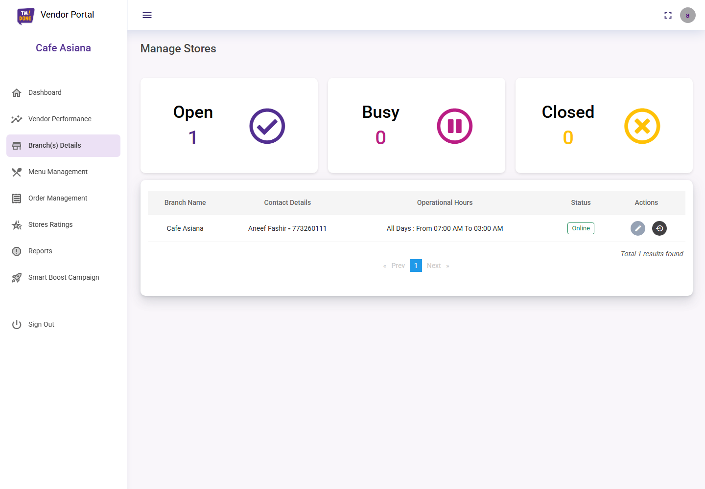
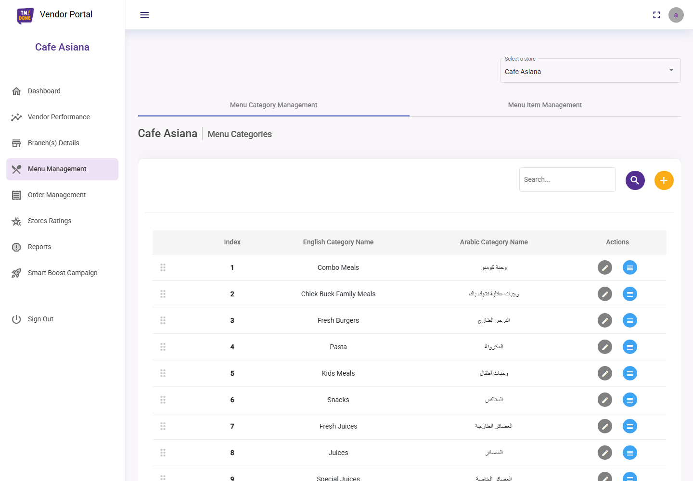
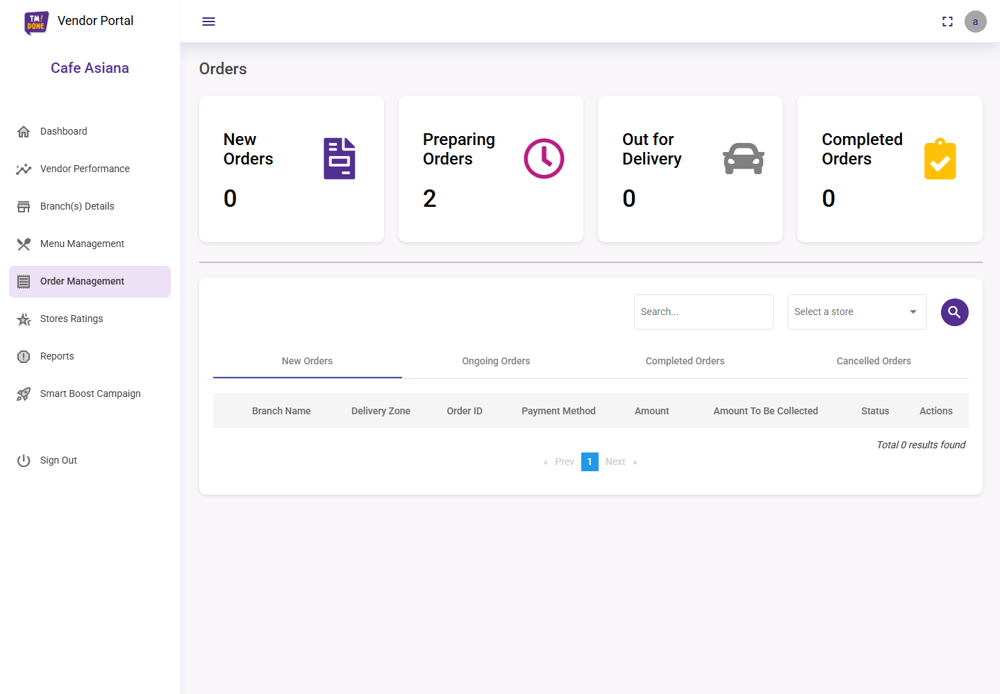
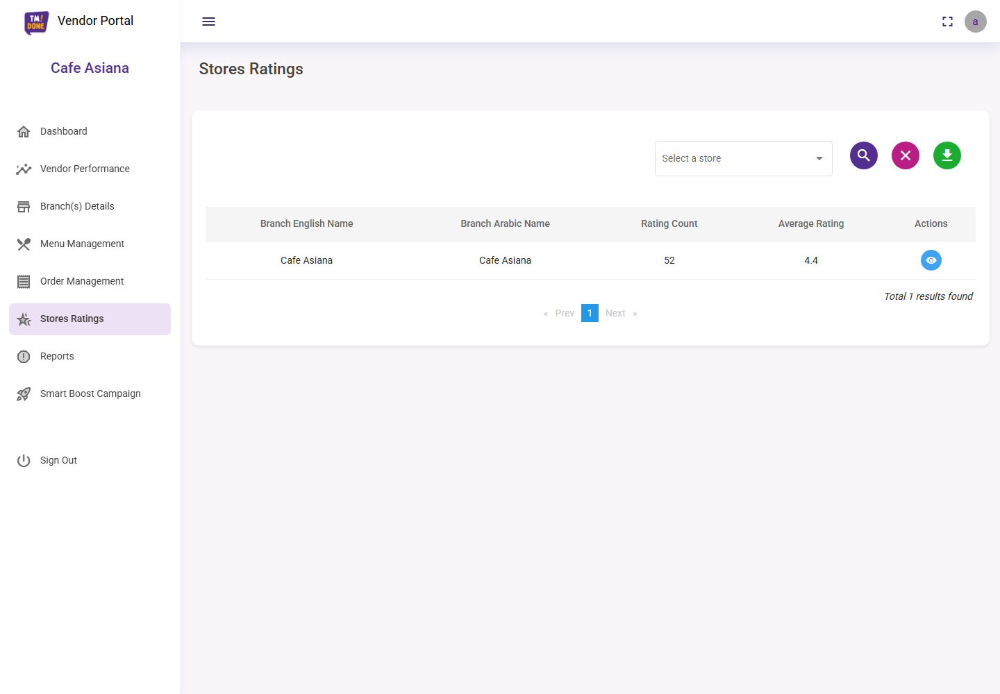
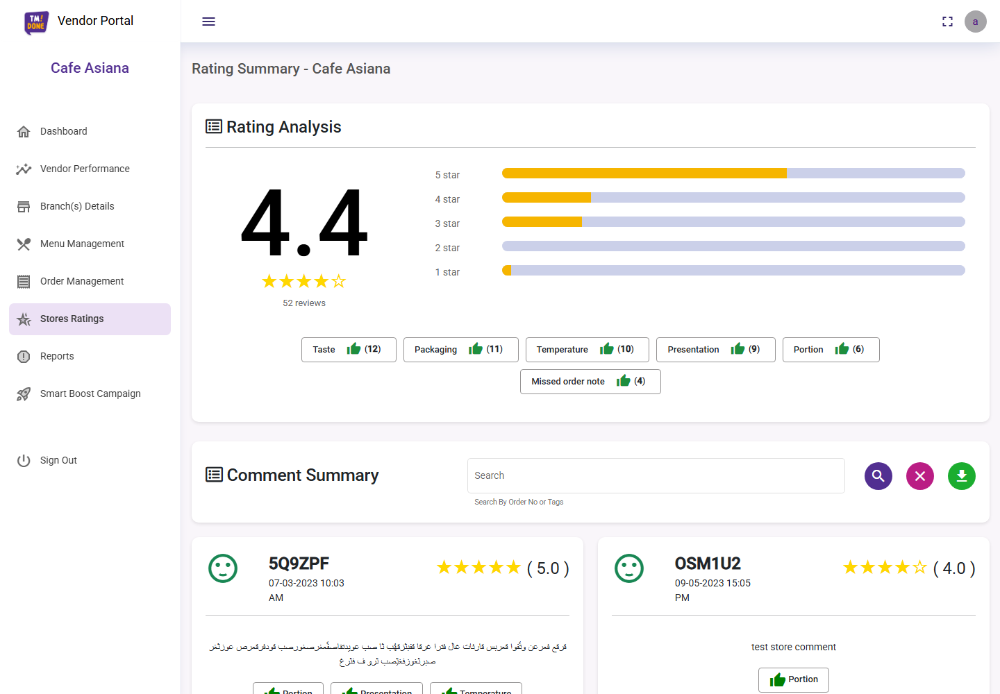
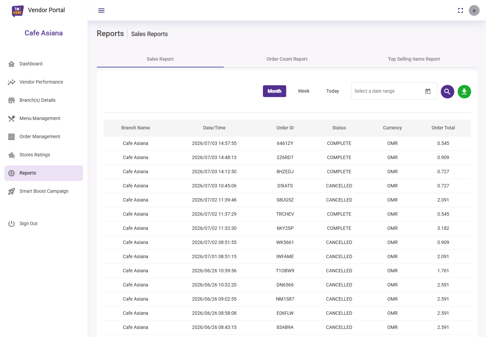
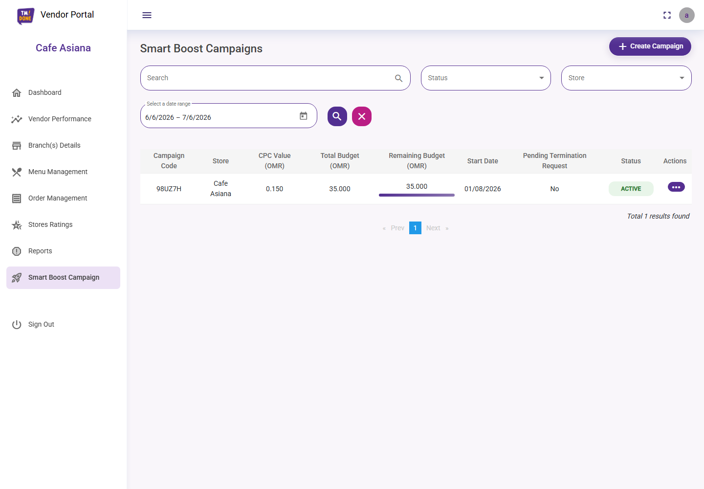

# TMDONE Vendor Portal

Playwright end-to-end test automation suite for the TMDONE Vendor Portal.

[](https://github.com/lakmal-codezync/TMDONE-VENDOR-Portal/actions/workflows/playwright.yml)

## Test Cases

- [Vendor Portal Test Cases](https://docs.google.com/document/d/1LNpOB8PYtULynPEraY3BP1dIbjIbN8qhcU7SzwDlKJ8/edit?usp=sharing)

## Screenshots

| Login | Dashboard |
| --- | --- |
|  |  |

| Vendor Performance | Branch Details |
| --- | --- |
|  |  |

| Menu Management | Order Management |
| --- | --- |
|  |  |

| Stores Ratings | Stores Ratings Summary |
| --- | --- |
|  |  |

| Reports | Smart Boost Campaign |
| --- | --- |
|  |  |

## Covered Areas

- Login and authentication redirects
- Dashboard summaries, filters, and charts
- Vendor performance reports
- Branch details
- Menu category and item management
- Stores ratings and review summary
- Reports
- Smart Boost campaign flows
- Order management
- System navigation, protected routes, and sign out

## Quick Start

```bash
npm install
npx playwright install
npm test
```

## Useful Commands

```bash
npm test
npm run test:login
npm run test:dashboard
npm run test:reports
npm run test:smart-boost-campaign
npm run test:order-management
npm run test:system-coverage
npm run report
```

## Environment Variables

The suite can use default demo values from `tests/data/vendorPortalData.js`, or these environment variables:

```bash
VENDOR_PORTAL_BASE_URL=https://partner.demo.dr.tmd1.org
VENDOR_PORTAL_USERNAME=your_vendor_username
VENDOR_PORTAL_PASSWORD=your_vendor_password
```

For GitHub Actions, add these as repository secrets:

- `VENDOR_PORTAL_BASE_URL`
- `VENDOR_PORTAL_USERNAME`
- `VENDOR_PORTAL_PASSWORD`

## CI/CD

GitHub Actions runs the Playwright suite on pushes and pull requests to `main`. The workflow installs dependencies, installs Chromium, runs the tests, and uploads the Playwright report as an artifact.
